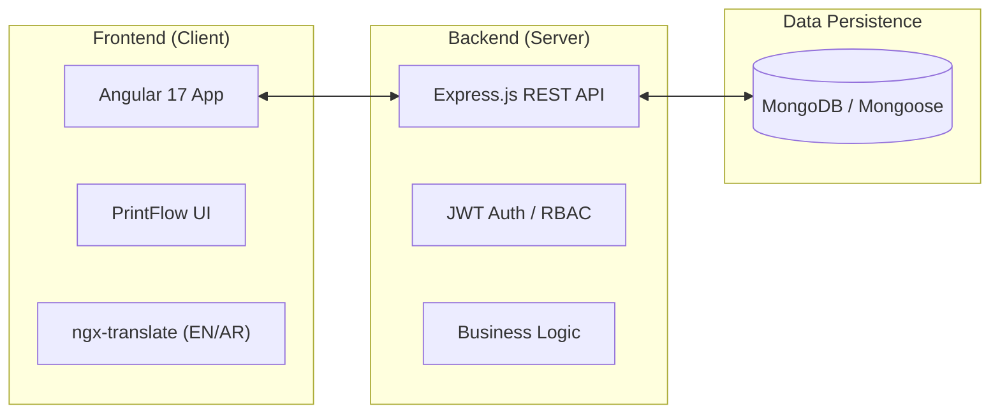
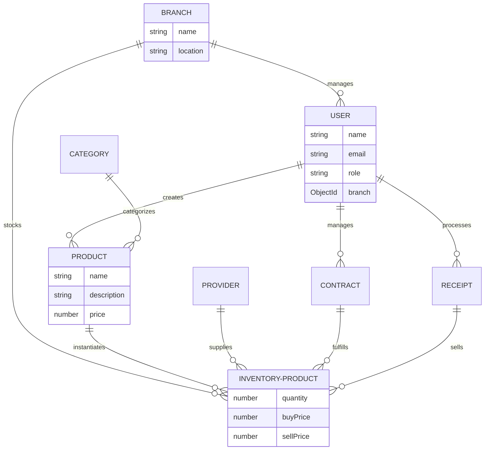

# 🏭 OptiFactory ERP

**OptiFactory ERP** is a state-of-the-art, full-stack enterprise resource planning system tailored for modern manufacturing and inventory environments. It features a high-performance **Node.js/Express** backend and a sleek, reactive **Angular 17** frontend, providing a seamless experience for managing branches, logistics, and sales in real-time.

---

## ✨ Key Features

- 🏪 **Multi-Branch Operations**: Real-time synchronization and localized inventory tracking across infinite branch locations.
- 👥 **Advanced RBAC**: Granular Role-Based Access Control (Admin, Manager, Cashier) ensuring secure operations.
- 📦 **Dynamic Inventory**: Real-time stock tracking with automatic deductions, low-stock alerts, and multi-provider support.
- 💰 **Profit-Centric Sales**: Intelligent sales processing with automatic profit margin calculations and historical revenue tracking.
- 📑 **Contractual Logistics**: Full lifecycle management of purchase contracts, from pending request to inventory fulfillment.
- 🌍 **Premium Localization**: Native support for **English and Arabic** with a pixel-perfect RTL (Right-to-Left) layout engine.
- 💹 **Advanced Analytics**: Daily reports, top-selling product insights, and branch-level performance summaries.

---

## 🏗️ System Architecture

The following diagram illustrates the high-level flow between the client application, the API server, and the database infrastructure.



---

## 🗄️ Database Schema

Our document-oriented schema is optimized for query speed and data integrity.



---

## 🛠️ Technology Stack

### **Frontend Architecture**
- **Framework**: Angular 17 (Standalone Components)
- **Styling**: Tailwind CSS with custom **PrintFlow** Design System
- **Localization**: `@ngx-translate` for full I18n and RTL support
- **State Management**: Reactive streams with **RxJS**
- **Icons**: Mat-Icon & Custom SVGs

### **Backend Architecture**
- **Runtime**: Node.js & Express
- **Database**: MongoDB with Mongoose ODM
- **Security**: JWT (Access + Refresh), Bcrypt, Helmet, XSS-Clean
- **Utilities**: Express-Rate-Limit, CatchAsync Error handling
- **Communication**: Nodemailer for transactional emails

---

## 👥 Roles & Permissions (RBAC)

OptiFactory enforces a strict hierarchy to ensure data integrity and security.

| Feature | Admin | Manager | Cashier |
| :--- | :---: | :---: | :---: |
| **Manage Branches** | ✅ | ✅ (Own Only) | ❌ |
| **Manage Users** | ✅ | ✅ (Own Cashiers) | ❌ |
| **Create Products** | ✅ | ✅ | ❌ |
| **Manage Categories** | ✅ | ❌ | ❌ |
| **Create Contracts** | ✅ | ✅ | ❌ |
| **Approve Contracts** | ✅ | ✅ | ❌ |
| **Process Sales** | ❌ | ❌ | ✅ |
| **View Reports** | ✅ | ✅ | ❌ |

---

## 🎨 PrintFlow Design System

The application utilizes a proprietary UI system called **PrintFlow**, defined by:
- **Consistent Tokens**: High-contrast dark mode and premium light mode palettes.
- **Reusable Components**: `ButtonVariant`, `InputComponent`, `BadgeVariant`, `CardComponent`.
- **Micro-Animations**: Smooth transitions and hover effects for a premium feel.
- **RTL-First Design**: Logical CSS properties ensuring seamless translation between English and Arabic.

---

## 🚀 Installation & Setup

### **1. Prerequisites**
- **Node.js** (v18 or higher)
- **MongoDB** (Local or Atlas instance)
- **Angular CLI** (`npm i -g @angular/cli`)

### **2. Backend Configuration**
```bash
cd server
npm install
```
Create a `.env` file in the `server` root:
```env
PORT=5000
MONGODB_URI=your_mongodb_connection_string
JWT_SECRET=your_super_secret_key
JWT_EXPIRES_IN=90d
JWT_REFRESH_SECRET=your_refresh_secret
JWT_REFRESH_EXPIRES_IN=120d
```
Start the server:
```bash
npm start
```

### **3. Frontend Configuration**
```bash
cd Client
npm install
```
Start the development server:
```bash
npm start
```
The app will be available at `http://localhost:4200`.

---

## 📖 API Documentation Summary

The API provides RESTful endpoints with consistent JSON responses. All protected routes require a `Bearer <token>` in the `Authorization` header.

### **Authentication**
- `POST /api/login`: Global login for all roles.
- `POST /api/signup`: Register new managers (Admin only).
- `POST /api/refreshToken`: Rotate JWT tokens.

### **Inventory & Products**
- `GET /api/products`: Filterable product catalog.
- `POST /api/products`: Create new base products (Multipart/form-data support).
- `GET /api/inventory`: Real-time stock levels for the user's branch.

### **Sales & Operations**
- `POST /api/sales`: Create a new transactional receipt.
- `GET /api/sales/daily-report`: Aggregate sales data for the current day.
- `PATCH /api/sales/:id/refund`: Full receipt refund and stock restoration.

> [!TIP]
> For a full list of over 50+ endpoints and detailed request/response schemas, refer to the [Internal API Documentation](file:///home/mostafa/Public/Vs%20Projects/Projects/Inventory/server/DOCUMENTATION.md).

---

## 📦 Core Dependencies

**Server-side**: `mongoose`, `jsonwebtoken`, `bcrypt`, `express-rate-limit`, `helmet`, `xss-clean`, `multer`.
**Client-side**: `@angular/material`, `@ngx-translate/core`, `tailwindcss`, `rxjs`, `@angular/ssr`.

---

## 🚢 Deployment Guidelines

- **Database**: Use MongoDB Atlas for production-grade scaling.
- **Frontend**: Build using `ng build --configuration production` and serve via Nginx or a CDN.
- **Backend**: Use PM2 for process management and a reverse proxy (Nginx) with SSL.
- **Environment**: Ensure all `JWT_SECRET` and `MONGODB_URI` variables are set in the production CI/CD environment.

---

**OptiFactory ERP.** *Efficiency. Scalability. Perfection.*
