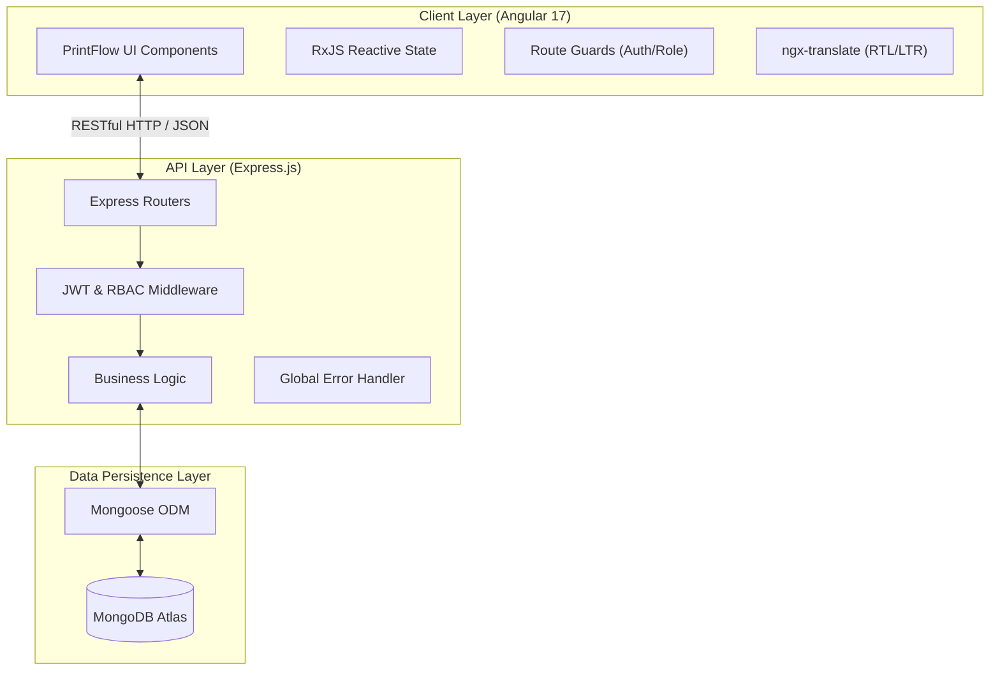
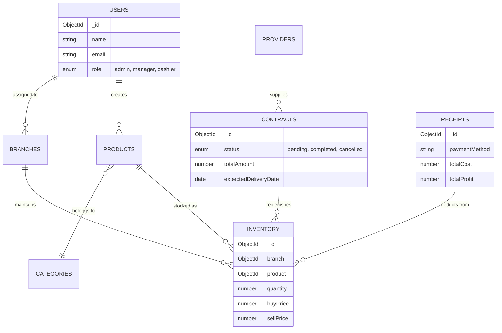

# 🏭 OptiFactory ERP - Complete Technical Documentation

## 📋 Executive Summary
**OptiFactory ERP** is a modern, enterprise-grade inventory and resource planning system designed specifically for multifaceted manufacturing and retail operations. It combines an ultra-fast Node.js/Express backend with a highly reactive Angular 17 frontend, empowering administrators, managers, and cashiers with real-time operational insights, localized interfaces (English/Arabic), and robust stock management.

---

## ✨ Core Features & Capabilities

- **🏢 Multi-Branch Architecture**: Real-time synchronization and localized stock tracking across unlimited branch locations.
- **🛡️ Granular RBAC (Role-Based Access Control)**:
  - *Admin*: Global oversight, user provisioning, categories management.
  - *Manager*: Branch-specific inventory management, purchase contract execution, full reporting visibility.
  - *Cashier*: Streamlined POS (Point of Sale) transaction processing and localized receipt management.
- **📦 Dynamic Inventory Engine**: Features auto-deductions upon sale, low-stock alerts, and integrated restocks via purchase contracts.
- **📄 Contractual Logistics**: Full lifecycle management for purchase orders, tracking supplier (Provider) shipments until inventory fulfillment.
- **💹 Reporting & Analytics**: Branch-level data aggregation, top-selling product discovery, and daily revenue snapshots restricted to Manager+ roles.
- **🌍 Premier Internationalization (i18n)**: Out-of-the-box Arabic and English support with native RTL layout optimization using logical CSS properties.

---

## 🏗️ System Architecture

OptiFactory adopts a decoupled Client-Server architecture interacting with a document-oriented NoSQL database.



---

## 💻 Tech Stack Deep-Dive

### 🎨 Frontend (Client)
- **Core Framework**: Angular 17 (utilizing Standalone Components and the new Control Flow syntax)
- **Styling**: Tailwind CSS, extended via a bespoke UI engine named **"PrintFlow"**
- **Design System ("PrintFlow")**: Reusable component directives (e.g., `[appInput]`, `[appButton]`) ensuring high-contrast neo-brutalist aesthetics and consistent layout.
- **Localization**: `@ngx-translate/core` with bidirectional logical CSS formatting (using features like `ms-auto`, `pe-4`).
- **State Management & Routing**: `RxJS`, `HttpInterceptors` (for appending bearer tokens and global error catching).

### ⚙️ Backend (Server)
- **Core Engine**: Node.js utilizing the Express.js framework
- **Security Posture**: Helmet.js (HTTP Headers), XSS-Clean, Express Rate Limiting, and Bcrypt for aggressive password hashing.
- **Authentication**: Stateless robust JWT implementation (access and refresh token rotation schemes).
- **Database**: MongoDB interacting via Mongoose Object Data Modeling (ODM).
- **Communication Pipelines**: Nodemailer configured for transactional events and Multi-part form-data parsing via Multer (for robust product image handling).

---

## 🗄️ Database Schema Representation

The Data Model is highly optimized for fast read-heavy queries and reliable transnational modifications representing stock levels.



---

## 📱 Frontend Modules & Routing

The Client application is lazy-loaded to optimize bundle size and enforce high-performance TTI (Time to Interactive).

### Core Feature Modules:
1. **Auth (`/auth`)**: Login flows, Token management.
2. **Dashboard (`/dashboard`)**: KPI metrics, animated alert systems for rapid situational awareness.
3. **Products (`/products`)**: Centralized catalog of master items holding meta-data and taxonomy.
4. **Inventory (`/inventory`)**: Physical stocks mapping products to unique branches with real-time value indexing.
5. **Sales (`/sales`)**: POS system logic mapping incoming receipts immediately against branch-level inventory.
6. **Contracts (`/contracts`)**: Purchase order origination and fulfillment tracking logic.
7. **Reports (`/reports`)**: High-level statistical charts and printable logs (Protected by Manager Guard).
8. **Categories, Brands, & Users**: Setup and access provisioning modules primarily mapped to Admins.

---

## 🔌 API Documentation Summary

The system boasts over 50 RESTful endpoints optimized for JSON ingestion. Below is the structural summary of the API namespace.

### `Auth & Users`
- `POST /api/login` - Authenticate and yield JWT Pair.
- `POST /api/signup` - Scaffold initial administrative accounts.
- `GET /api/me` - Self-identify user object.

### `Catalog Management`
- `GET/POST /api/products` - Base catalog retrieval and multipart-form data ingestion for imagery.
- `GET/POST /api/categories` - Product taxonomy control.

### `Logistics & Logistics`
- `GET/POST /api/branches` - Structural node mapping.
- `GET /api/inventory` - Retrieve localized stock pools.
- `POST /api/contracts` - Initialize restocking orders mapping Providers to Products.
- `PATCH /api/contracts/:id/approve` - Authorize contract completion, invoking a transactional hook to restock mapped `Inventory` items.

### `Point of Sale (POS)`
- `POST /api/sales` - Trigger atomic purchase transactions, immediately mutating `Inventory` limits to prevent over-drafting.
- `GET /api/sales/daily-report` - Roll-up analytics of revenue metrics.

*(Note: Advanced parameters such as `?page=x&limit=y&status=z` are integrated natively onto all list-retrieval mechanisms for broad pagination matching).*

---

## 🚀 Environment Setup & Deployment

### 1. Requirements
Ensure **Node v18+**, **Angular CLI 17.x**, and a running **MongoDB** daemon (or Atlas Cluster URI) are available locally.

### 2. Backend Initialization
1. Navigate to `/server`
2. Run `npm install`
3. Prepare a local `.env` overriding secrets:
   ```env
   PORT=5000
   MONGODB_URI=your_mongodb_connection_string
   JWT_SECRET=super_secure_jwt_hash
   JWT_EXPIRES_IN=90d
   ```
4. Start process: `npm start`

### 3. Frontend Initialization
1. Navigate to `/Client`
2. Run `npm install`
3. Launch development host via `npm start`
4. Access via [http://localhost:4200](http://localhost:4200)

### 4. Continuous Deployment Recommendations
We recommend scaling on **PM2** runtime mapping Node to a reverse proxy (Nginx). The Angular suite should compile via `ng build --configuration production` with the static `/dist` array served over a CDN edge network to ensure latency minimization.
